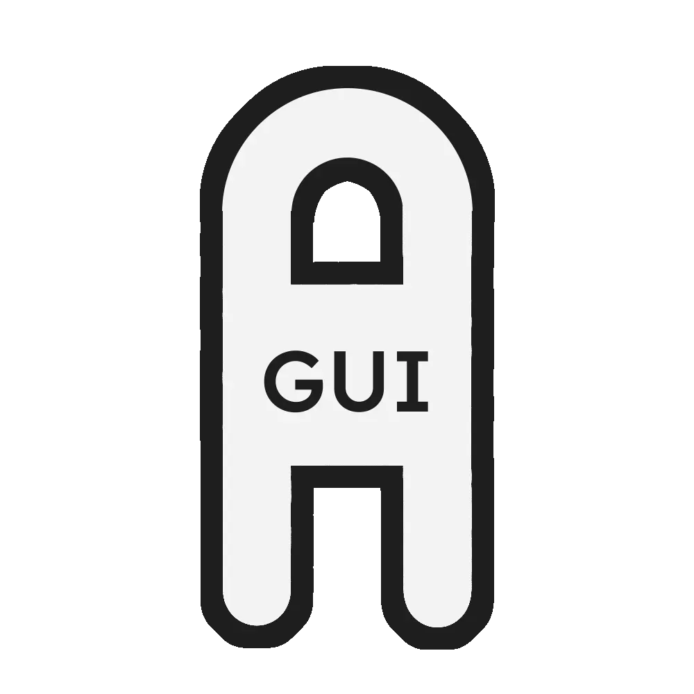

<div align="center">
    <a href="https://github.com/stumblinbear/agui">
        
    </a>
    <br />
    An advanced, reactive UI library for Rust
    <br />
    <a href="https://github.com/stumblinbear/agui/issues/new?assignees=&labels=bug&template=BUG_REPORT.md&title=bug%3A+">
        Report a Bug
    </a>
    ·
    <a href="https://github.com/stumblinbear/agui/discussions">
        Request a Feature
    </a>
    .
    <a href="https://github.com/stumblinbear/agui/discussions">
        Ask a Question
    </a>
    <br />
    <br />
    <a href="https://github.com/stumblinbear/agui/actions/workflows/rust.yml">
        
    </a>
    <a href="https://crates.io/crates/agui">
        
    </a>
    <a href="https://docs.rs/agui">
        
    </a>
</div>

---

## What is agui?

Agui is an advanced reactive GUI project for Rust, inspired by Flutter and taking some concepts from other related UI systems.

> [!IMPORTANT]
> This library is in the middle of a sizable rework and therefore is not currently in a state where usage is technically feasible. The docs are also very out of date and will be updated once this work is nearing completion.

# 🛠️ Installation

Agui is available on [crates.io](https://crates.io/crates/agui), Rust's official package repository. Just add this to your `Cargo.toml` file:

```toml
[dependencies]
agui = "0.3" # ensure this is the latest version
```

# 🚀 Usage

Docs for `agui` are under development, however you can check the `examples` directory for basic setup, and `agui_primitives`/`agui_widgets` for many examples on widget creation.

## Creating new widgets

Currently, widgets are created using `StatelessWidget`, `StatefulWidget`, `LayoutWidget`, `PaintWidget`, and `InheritedWidget` derive macros, and by implementing their respective trait.

```rust
#[derive(Default, StatelessWidget)]
pub struct MyWidget {
    // Widget is the convention for passing children. Vec<Widget> should be used for passing variable amounts.
    pub child: Widget,
}

impl WidgetBuild for MyWidget {
    fn build(&self, ctx: &mut BuildContext<Self>) -> Widget {
        build! {
            Button {
                // Widgets are stored as Rcs, so cloning has little overhead
                child: self.child.clone(),
            }
        }
    }
}
```

## What's `build!`?

The `build!` macro makes it significantly cleaner and easier to init new widgets. All it does is initialize unset fields in a struct to their `Default::default()`, and add `.into()` to the struct itself.

```rust
// It allows us to turn this:

fn build(&self, ctx: &mut BuildContext) -> Widget {
    Widget::new{
        Button {
            color: Color::default(),
            child: Widget::new(Text {
                text: String::from("A Button")
            })
        }
    )
}

// Into this:

use agui::macros::build;

fn build(&self, ctx: &mut BuildContext) -> Widget {
    build! {
        Button {
            child: Text {
                text: "A Button"
            }
        }
    }
}
```

A more complex widget implementation (featuring globals and computed values) can be seen in [the Button widget](crates/agui_widgets/src/button.rs).

# 🤝 Contributing

Contributions are encouraged, and very welcome. Feel free to check the [issues page](https://github.com/stumblinbear/agui/issues) if you wish to do so!

Please go through existing issues and pull requests to check if somebody else is already working on it. Also, make sure to run `cargo test` before you commit your changes!
