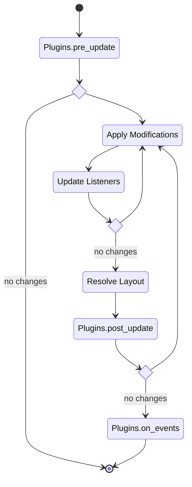

```mermaid
stateDiagram-v2
    PluginsPreUpdate: Plugins.pre_update
    ApplyMods: Apply Modifications
    UpdateListeners: Update Listeners
    ResolveLayout: Resolve Layout
    PluginsPostUpdate: Plugins.post_update
    PluginsOnEvents: Plugins.on_events

    state if_has_modifications <<choice>>
    state if_update_caused_modifications <<choice>>
    state if_layout_caused_modifications <<choice>>

    [*] --> PluginsPreUpdate
    PluginsPreUpdate --> if_has_modifications

    if_has_modifications --> ApplyMods
    if_has_modifications --> [*]: no changes

    ApplyMods --> UpdateListeners

    UpdateListeners --> if_update_caused_modifications
    if_update_caused_modifications --> ApplyMods
    if_update_caused_modifications --> ResolveLayout: no changes

    ResolveLayout --> PluginsPostUpdate

    PluginsPostUpdate --> if_layout_caused_modifications
    if_layout_caused_modifications --> ApplyMods
    if_layout_caused_modifications --> PluginsOnEvents: no changes
    PluginsOnEvents --> [*]
```